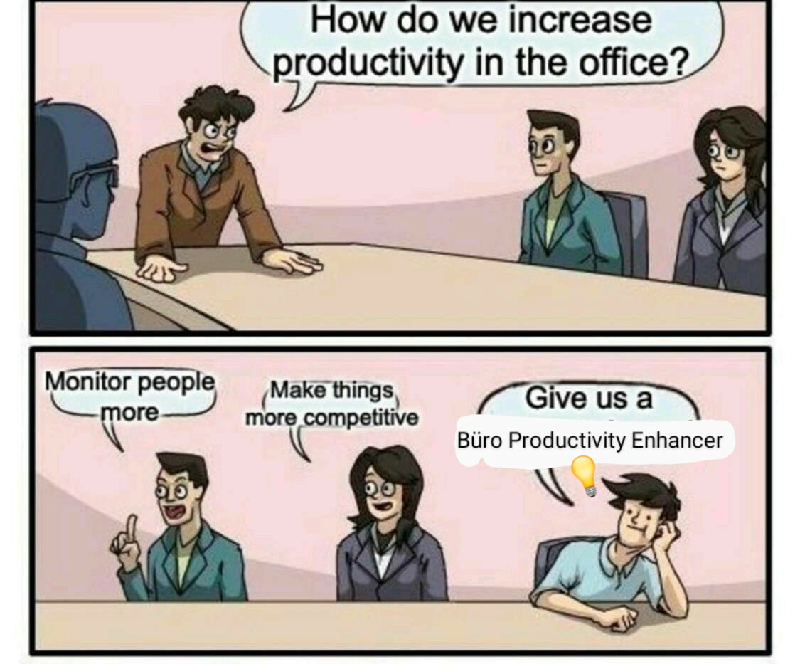

# IoT Project
# Author: Neha Prakash
# Büro Productivity Enhancer: Beat the Büro Blues
*****
# Introduction 
*****
An innovative way to improve the productivity in gray office space, is to virtualize the ambience! And there is nothing better than being able to look at bright blue sky to improve the mood.

### The main aim of the project is to:
*****
* Display the bright outside environment on windows during blues.
* Enhance the comfort by controlling the temperature in the office.
* Intelligent lighting solutions by monitoring ample light from windows.
